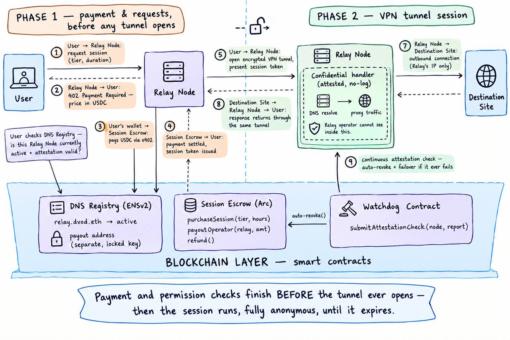

# DVoD — DeVPN-over-DeDNS

> Anonymous internet access with enforceable, revocable permissions. Users pay for a
> time-boxed session at a chosen bandwidth tier; their traffic tunnels through an
> authorized relay operator whose tunnel-termination, DNS-resolution, and outbound-proxy
> logic runs inside a Chainlink CRE confidential handler, so the operator's own machine
> cannot read or log it. Which operators are authorized lives in an ENSv2 registry,
> revocable by a permissionless watchdog contract. Payment settles in USDC on Arc via
> x402, as a batched per-session purchase.

## Architecture



Payment and permission checks (ENSv2 registry lookup, attestation check, x402 purchase
on Arc) all complete **before** any tunnel opens. Once open, the session runs fully
anonymous — DNS + proxy traffic inside the relay's attested confidential handler — until
it expires or the watchdog contract revokes the relay.
## Status

Phase 0 (foundations) is complete — see the [build phases](#build-phases) below. This
section will grow into a proper quickstart, threat model summary, and "what's real vs.
simulated" breakdown as later phases land (tracked in `docs/SECURITY.md` once written).

## Build phases

| Phase | Scope | Status |
|---|---|---|
| 0 | Monorepo scaffold, session-spec, ui tokens, CI | ✅ done (`v0.1-phase0`) |
| 1 | ENSv2 registry + watchdog contract | not started |
| 2 | Arc + x402 session purchase | not started |
| 3 | Chainlink CRE relay handler | not started |
| 4 | Orchestrator + web app | not started |
| 5 | Hardening, docs, demo | not started |

## Repo layout

```
/apps            web app + orchestrator service
/packages        session-spec, ui, chain-adapters, identity
/relay           Chainlink CRE confidential handler + relay node image
/contracts       SessionEscrow.sol (Arc), WatchdogRevoker.sol (ENS)
/docs            architecture diagram, security/pricing docs, demo script
```

## Developing

```bash
pnpm install
pnpm lint
pnpm typecheck
pnpm test
```
